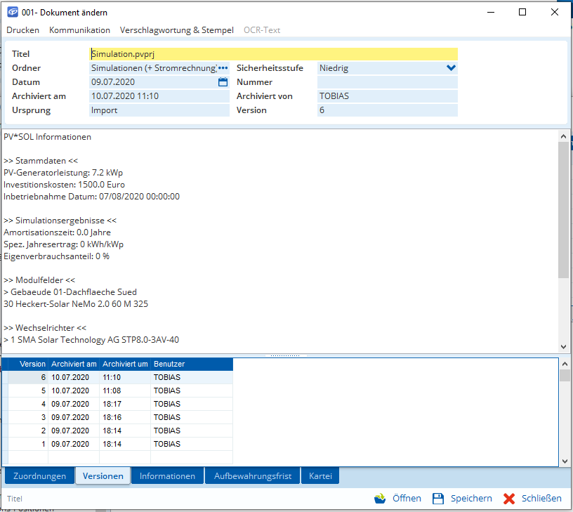

# (Unofficial) TAIFUN openDocuments - Workaround

Ein Workaround für TAIFUN openDocument mit dem nicht unterstützte Dateien (zB. .zip-Archive) geöffnet und versioniert werden können.

## Features
* TAIFUN openDocument um die Unterstützung von Archiven erweitern
* Leicht erweiterbar durch Auslagerung von Code in PowerShell-Skripte
* Zusammenfassung des Dateiinhaltes  



*Hier im Beispiel eine Simulation mit PV\*SOL Premium (.pvprj)*


## Installieren und Einrichten
1. `taifun_open_files.exe` und `options.ini` von der [Release](https://github.com/otsmr/taifun-workaround/releases) Seite herunterladen
2. `options.ini` anpassen
```ini
# PV*SOL Premium
addfile_ext=.pvprj
addfile_infotitle=PV*SOL Informationen
addfile_firstChars=PK
addfile_inLineOne=OecForeCast.json
addfile_getinfo=pvprj.ps1
```
4. `taifun_open_files.exe` und `options.ini` zB. in den Ornder `%AppData%\taifun-workaround` verschieben
3. Standardprogramm für `.txt` auf die Anwendung `%AppData%\taifun_open_files.exe` ändern

## Ablauf

**Datei ins Archiv hinzufügen**
1. Wenn noch nicht vorhanden: Neue Datei erstellen (zB. `test.zip`)
2. Dateiendung auf `.txt` ändern (zB. `test.zip.txt`)
3. Datei ins Archiv hinzufügen

**Datei aus dem Archiv öffnen (*Hintergrund*)**
1. `taifun_open_files.exe` wird gestartet
2. Es wird eine Kopie angelegt `{GUID}.txt` -> `%Temp%\TaifunFiles\{GUID}.[Erkannte Dateiendung]`
3. die Kopie wird als Child-Prozess von `taifun_open_files.exe` mit dem Standardprogramm geöffnet

**Datei wurde geändert und das Bearbeitungsprogramm geschlossen (*Hintergrund*)**

4. Die Originaldatei wird überschrieben: `%Temp%\TaifunFiles\{GUID}.[Erkannte Dateiendung]` -> `{GUID}.txt`
6. `taifun_open_files.exe` schließt sich automatisch 
7. TAIFUN erkennt die Beendigung des Child-Prozesses und zeigt die Optionen für die Versionierung im Falle einer Änderung an

## Fallback

Wenn eine .txt Datei mit `taifun_open_files.exe` geöffnet wird und der Parent-Process nicht `tfw.exe` heißt wird der Fallback gestartet. Standard ist notepad.exe.

## Ideen

### PV*SOL Premium

1. Beim öffnen einer PV*Sol-Datei aus TAIFUN openDocuments wird neben der Datei ein Ordner angelegt, in dem Zusatzinformationen (zB. Dachmaße, Screenshots, ...) zu dem Projekt gespeichert werden können
2. Wenn schon vorhanden wird er ggf. nur kopiert
4. *PV\*Sol wird geöffnet*
4. Der Zusatzordner wird automatisch (anpassbar über die `options.ini`) mit geöffnet
4. ODER: wenn PV*SOL Premium nicht auf dem Rechner installiert ist, wird nur dieser Ornder geöffnet (Es wird eine MsBox geöffnet: Änderungen im Ordner übernehmen - Abbrechen)
5. *PV\*Sol wird geschlossen*
6. Der Zusatzordner wird dem  .pvprj Archiv hinzugefügt

Verknüpfung zum aktuellen Ordner in den ``TaifunFiles`` (<- An den Schnellzugriff anheften) anlegen.

```ini
fallback=C:\Windows\system32\notepad.exe
```